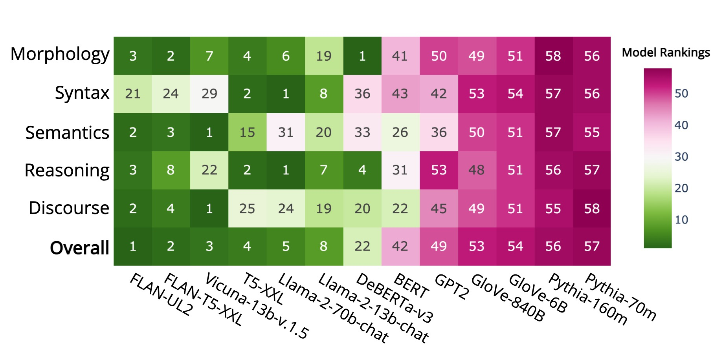
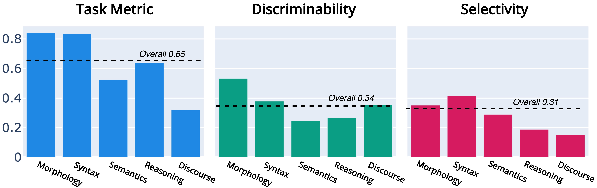
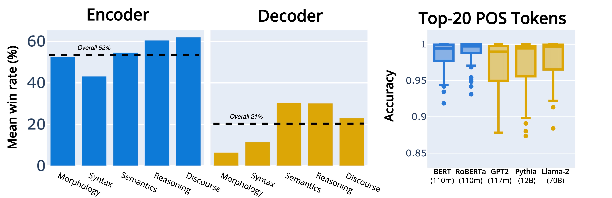
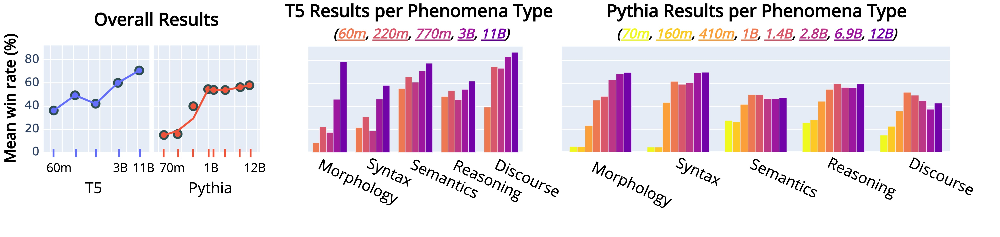
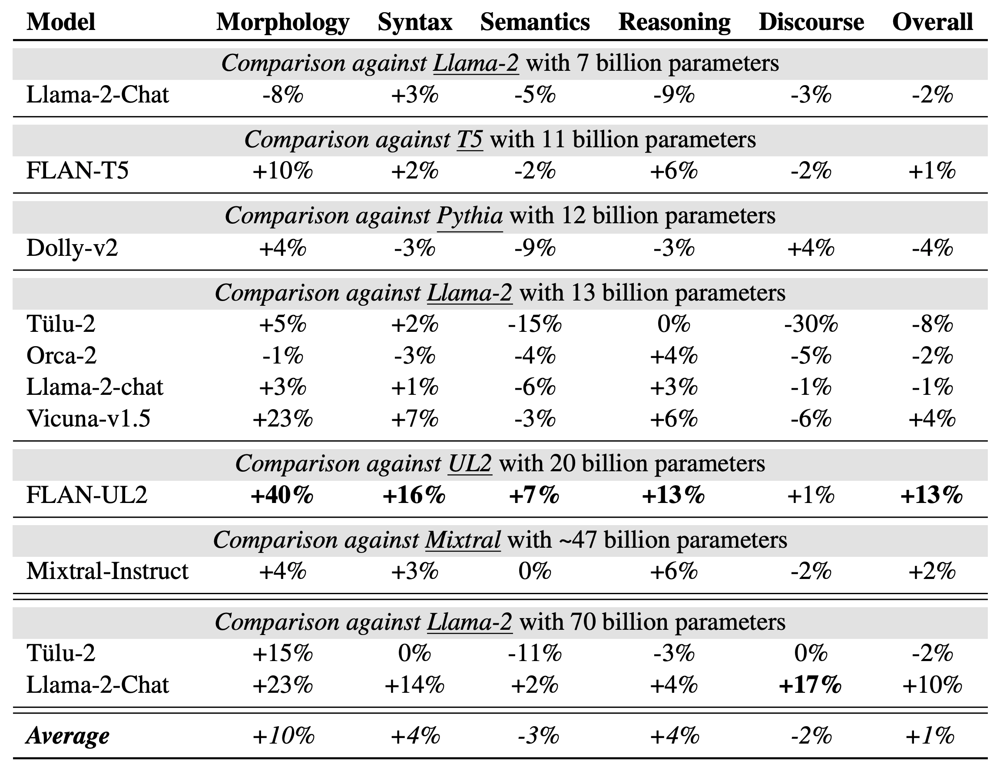

The evaluation of various language models yields to serval insights.
Find more details and further discussions in our <a href="todo">paper</a>.
Any questions or wondering about other details? Happy to <a href= "mailto:holmesbenchmark@gmail.com">chat</a>.

# The Linguistic Competence of Language Models
The linguistic competence is heterogeneously learned by language models as no single one constantly exceeds.

*Figure 1, Ranking of best and selected language models*

Language models clearly better understand *morphology* and *syntax* than *semantics*, *reasoning*, and *discourse*.
This distinction is evident in morphology and syntax's significantly higher Task Metric (`f1 macro` or `regression`).
Next, it makes sense to differentiate between the phenomena types (like *morphology* or *discourse*).
We find they have balanced *Discriminability* scores, which means that none of them dominates the overall ranking.
*Discriminability* measures the rank correlation of a specific dataset with the overall Holmes🔎 rankings.
Finally, the substantial *Selectivity* underlines the validity of our probing setup.
Compared to training a probe using randomized labels, our probes effectively detect linguistic patterns in the internal representation space of language models.

*Figure 2, Aggregated results over all language models and dataset.*

# Language Model Architecture
The architecture of language models a clear effect on their linguistic competence. 
We compare encoder-only and decoder-only language models of up to 220 million parameters.
The linguistic competence of encoder-only models is clearly more pronounced than of decoder-only ones, across all phenomena types.
We assume that instabilities of the token-level internal representations causing these deficiencies of decoder-only models. 
Diving into the detail confirm this assumption.
We find that even with 70 billion parameters, decoder-only language models do not reach the accuracy of encoder-only one on the top-20 most common tokens for part-of-speech tagging. 

*Figure 3, Comparison of the linguistic competence for encoder-only and decoder-only language models.*

# Scaling Language Model Size
The linguistic competence of LMs scales with their model size, independent of their architecture, when exceeding 500 million (Pythia) or 1 billion parameters (T5).
We find that this trend is in particular prominent for *morphology* and *syntax* but less pronounced for *semantics*, *reasoning*, and *discourse*. 

*Figure 4, Overview of how the linguistic competence changes when increasing model size.*

# Instruction Tuning
Apart from the alignment with human interaction, instruction tuning has a prominent effect on the linguistic competence of LMs. 
We find a particular pronounced postive effect for *morphology*, *syntax*, and *resoning* - especially for larger language models, like FLAN-UL2 
In contrast, we find mixed effects for *discourse* and *semantics*.
Further, we analyze the role of instruction tuning data.
We find that quality has more positive effects on the linguistic competence of LMs than quantity, as Tülu (high quantity) underperforms and Vicuna (high quality) outperforms.

*Figure 5, Mean winning rate improvement in percentage compared to their pre-trained base model.*
